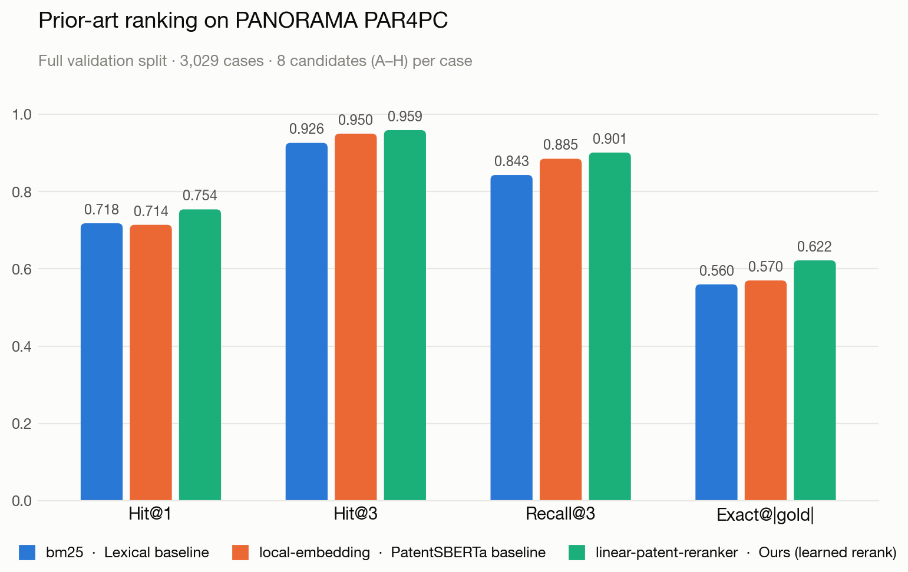
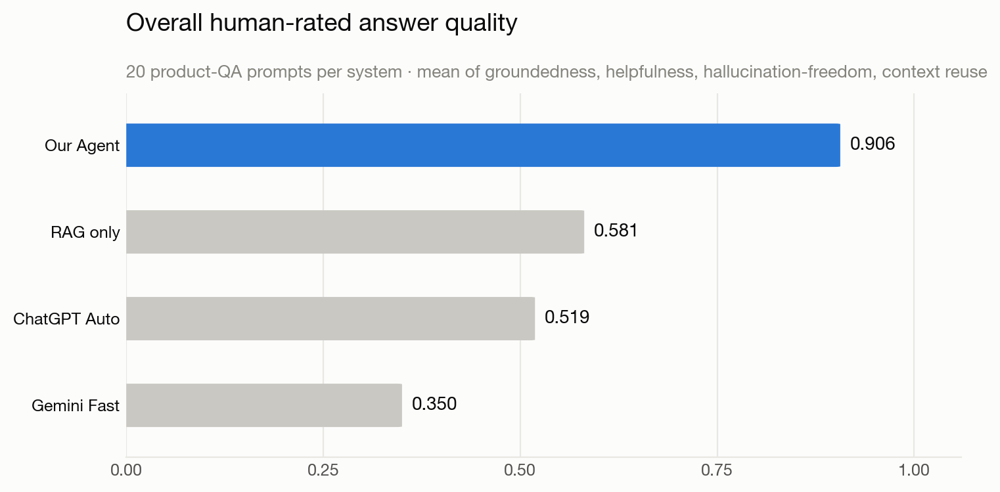
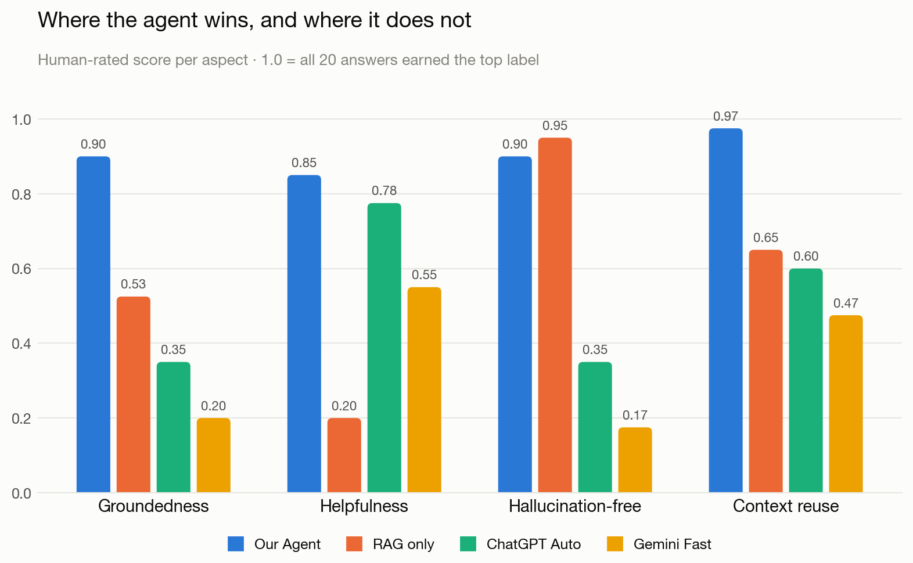
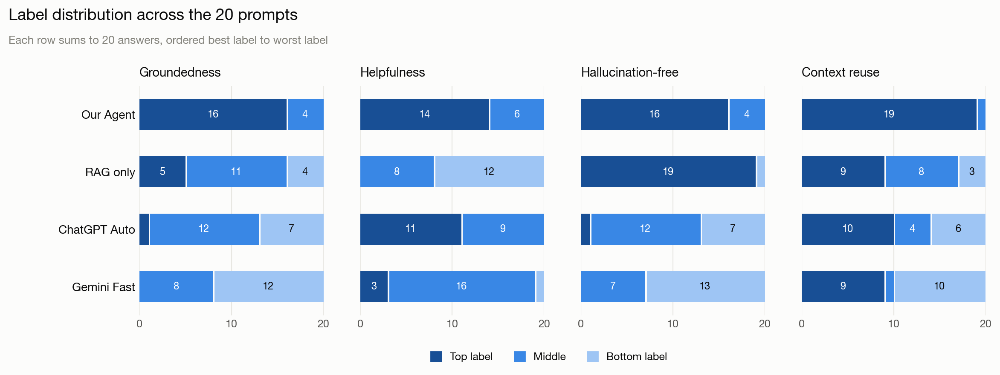

<div align="center">

# Patent Prior-Art Agent

**From patent retrieval to evidence-grounded prior-art analysis.**

A tool-using LLM agent that turns a patent claim, an invention idea, or a vague search
query into a ranked prior-art set, a limitation-level evidence chart, and a grounded
answer where every statement traces back to retrieved patent text.

[](environment.yml)
[](src/graph.py)
[](src/persistent_index.py)
[](docs/EVALUATION_PROTOCOL.md)
[](LICENSE)

[Results](#results) · [Architecture](#architecture) · [Quickstart](#quickstart) · [Documentation](#documentation) · [Slides](slides/)

</div>

---

## Why this exists

Prior-art search fails in three specific ways, and each one needs a different fix:

| Failure mode | What goes wrong | What we do about it |
|---|---|---|
| **Vocabulary mismatch** | Patent claims describe the same invention in deliberately different language, so keyword search misses relevant art. | Dense retrieval with `PatentSBERTa`, then a **learned reranker** over dense, BM25 and field-lexical features. |
| **Ranking is not analysis** | A ranked list does not say *why* a patent is relevant, or which claim limitation it reads on. | **Limitation-level evidence extraction** — every limitation is mapped to a specific title / abstract / claim snippet. |
| **Fluent but unsupported answers** | A one-shot LLM answer sounds authoritative while inventing patent mappings. | A separate **verification pass** labels the answer supported / partially supported / unsupported, with a reason. |

The result is a system that is *inspectable*: retrieval, evidence alignment, synthesis and
verification are separate, named steps rather than hidden behaviour inside one prompt.

> **Scope.** This is a first-pass prior-art exploration tool for inventors, researchers and
> students. It is not legal advice and it is not a substitute for a professional search.

---

## Results

### Prior-art ranking on PANORAMA PAR4PC

Full validation split — **3,029 cases**, 8 candidate patents (A–H) per case, gold relevance labels.



| Method | Hit@1 | Hit@3 | Recall@3 | Exact@\|gold\| |
|---|---:|---:|---:|---:|
| `bm25` — lexical baseline | 0.718 | 0.926 | 0.843 | 0.560 |
| `local-embedding` — PatentSBERTa baseline | 0.714 | 0.950 | 0.885 | 0.570 |
| **`linear-patent-reranker` — ours** | **0.754** | **0.959** | **0.901** | **0.622** |

The learned reranker is best on all four metrics. The largest gain is on
`Exact@|gold|` (+5.2 points over the PatentSBERTa baseline) — the metric that asks whether
the system recovers the *exact* gold prior-art set, not just one member of it.

<sub>Reproduce: `python -m src.evaluate_par4pc_hf --splits validation --max-rows-per-split 3029 --methods bm25 local-embedding linear-patent-reranker`</sub>

### Human evaluation of grounded answers

Retrieval metrics say nothing about whether the *answer* is trustworthy, so we ran a manual
study: **20 product-QA prompts**, each answered by four systems, each answer labelled by hand
on groundedness, helpfulness, hallucination and multi-turn context reuse.





| System | Grounded | Helpful | Hallucination-free | Context reuse | **Overall** |
|---|---:|---:|---:|---:|---:|
| **Our Agent** | **0.90** | **0.85** | 0.90 | **0.98** | **0.906** |
| RAG only | 0.53 | 0.20 | **0.95** | 0.65 | 0.581 |
| ChatGPT Auto | 0.35 | 0.78 | 0.35 | 0.60 | 0.519 |
| Gemini Fast | 0.20 | 0.55 | 0.18 | 0.48 | 0.350 |

The interesting result is the **trade-off the agent escapes**. Plain RAG is safe but useless
(0.95 hallucination-free, 0.20 helpful — it returns lists, not answers). The general
assistants are the mirror image: fluent and reasonably helpful, but they invent patent
mappings (0.35 and 0.18 hallucination-free). The agent is the only system that is
simultaneously helpful *and* grounded.



<sub>Raw annotations: [`docs/eval/`](docs/eval) · Protocol and label definitions: [`docs/HUMAN_EVALUATION.md`](docs/HUMAN_EVALUATION.md)</sub>

---

## Architecture


One shared FAISS patent index feeds two paths. The baseline retrieves and stops; the agent
adds four stages on top.

| Stage | Module | What it does |
|---|---|---|
| **01 · Plan** | [`src/query_planner.py`](src/query_planner.py), [`src/claim_analysis.py`](src/claim_analysis.py) | Classifies the turn (new search / follow-up / comparison / aspect filter / combination) and decomposes the claim into limitations. |
| **02 · Recall** | [`src/persistent_index.py`](src/persistent_index.py) | Coarse recall of `4·k` candidates from a persistent FAISS index (`IndexFlatIP`, cosine over 768-d PatentSBERTa vectors). |
| **03 · Rerank** | [`src/train_linear_patent_reranker.py`](src/train_linear_patent_reranker.py), [`src/patent_rerank.py`](src/patent_rerank.py) | Second-stage learned reranking on `dense_score`, `bm25_score`, `field_lexical_score`. |
| **04 · Align** | [`src/claim_analysis.py`](src/claim_analysis.py) | Selects the strongest title / abstract / claim snippet per limitation and builds the claim chart. |
| **05 · Synthesise** | [`src/free_text_qa.py`](src/free_text_qa.py), [`src/llm_tools.py`](src/llm_tools.py) | Generates an answer from the extracted evidence — heuristic by default, LLM-backed with an API key. |
| **06 · Verify** | [`src/claim_analysis.py`](src/claim_analysis.py), [`src/llm_tools.py`](src/llm_tools.py) | Checks the answer against the evidence and labels it supported / partially supported / unsupported. |

The whole thing is wired as an explicit [LangGraph](https://langchain-ai.github.io/langgraph/)
state graph in [`src/graph.py`](src/graph.py), so each stage is separately inspectable and
separately replaceable.

**Follow-up turns reuse the working set.** When the planner classifies a turn as a filter or a
comparison over previous results, the agent reranks the existing candidate set instead of
starting a new search — which is where the 0.98 context-reuse score comes from.

### Why a *linear* reranker

A three-feature logistic model is not the most powerful reranker available; it is the most
*defensible* one. It trains on 200 PAR4PC cases in seconds, its weights are readable, and it
beats a hand-tuned scoring path we tried earlier while being far easier to justify. The
earlier hand-tuned `patent-specialized` path is still in the tree for ablation
([`src/ablate_patent_specialized.py`](src/ablate_patent_specialized.py)) but is not the
shipped method.

---

## Quickstart

### 1 · Environment

```bash
git clone https://github.com/mingketian/PatentAgent.git
cd PatentAgent
conda env create -f environment.yml
conda activate patent-agent
```

The benchmark mode also needs the PANORAMA dataset as a sibling directory:

```bash
git clone https://github.com/LGAI-Research/PANORAMA.git ../PANORAMA
```

Expected layout:

```text
workspace/
├── PANORAMA/
└── PatentAgent/
```

### 2 · Configure (optional)

Everything below runs without an API key. Copy the template only if you want the LLM-backed
paths (LLM answer generation, LLM claim decomposition, LLM verification, `openai-embedding`,
`llm-rerank`):

```bash
cp .env.example .env   # then add OPENAI_API_KEY
```

### 3 · Run

The repository ships a 112-patent demo index and the trained reranker, so both UIs start
immediately with no build step.

| | Command | Opens |
|---|---|---|
| **Web demo** (FastAPI + single-page UI) | `cd web && ./start.sh` | <http://localhost:8899> |
| **Streamlit app** (benchmark + product modes) | `./scripts/run_app.sh` | <http://localhost:8501> |
| **CLI demos** | `python -m src.run_free_text_demo`<br>`python -m src.run_conversation_demo` | terminal |

For real use, build the full 17,877-patent index — the web server picks it up automatically once
it exists, and `PATENT_AGENT_INDEX_DIR` overrides both. See [`data/README.md`](data/README.md).

---

## Repository layout

```text
PatentAgent/
├── src/                  agent, retrieval, reranking, evaluation
│   ├── graph.py              LangGraph state machine (the six stages)
│   ├── retrieval.py          BM25 / dense / cross-encoder rankers
│   ├── patent_rerank.py      patent-specific features and scoring
│   ├── persistent_index.py   FAISS index build + search
│   ├── train_linear_patent_reranker.py   the shipped learned reranker
│   ├── claim_analysis.py     decomposition, evidence, verification
│   ├── query_planner.py      turn classification, working-set reuse
│   └── evaluate_par4pc*.py   benchmark harnesses
├── web/                  FastAPI backend + single-page demo UI
├── app.py                Streamlit app (benchmark + product modes)
├── site/                 project website (GitHub Pages)
├── docs/                 methods, protocols, results, proposal
│   └── eval/                 raw human-evaluation annotations
├── results/              committed figures and result tables
├── slides/               5-slide project deck
├── tools/                figure and table generation
└── data/                 demo index + trained reranker weights
```

---

## Documentation

| Document | Read it for |
|---|---|
| [`docs/ARCHITECTURE.md`](docs/ARCHITECTURE.md) | Stage-by-stage walkthrough with data shapes and module pointers |
| [`docs/METHODS_OVERVIEW.md`](docs/METHODS_OVERVIEW.md) | What each method is, and the distinctions that get confused |
| [`docs/EVALUATION_PROTOCOL.md`](docs/EVALUATION_PROTOCOL.md) | Dataset, case structure, metric definitions, what is *not* measured |
| [`docs/EVALUATION_RESULTS.md`](docs/EVALUATION_RESULTS.md) | Every retrieval number, with the command that produced it |
| [`docs/HUMAN_EVALUATION.md`](docs/HUMAN_EVALUATION.md) | Human study design, label rubric, per-category results |
| [`docs/PRODUCT_QA_CHECKLIST.md`](docs/PRODUCT_QA_CHECKLIST.md) | The 20-query manual QA script |
| [`docs/TEAM_HANDOFF.md`](docs/TEAM_HANDOFF.md) | UI settings, demo recipe, operational notes |
| [`docs/PROPOSAL.md`](docs/PROPOSAL.md) | The original project proposal |

Regenerate the committed tables and figures after new runs:

```bash
make figures   # rebuild results/tables and results/figures
make check     # compile every module, verify the tables match the source data
```

---

## Reproducing the evaluation

```bash
# full validation split, all three methods
python -m src.evaluate_par4pc_hf --splits validation --max-rows-per-split 3029 \
  --methods bm25 local-embedding linear-patent-reranker

# retrain the shipped reranker (seconds, 200 cases)
python -m src.train_linear_patent_reranker --mode train-default-model \
  --splits train --max-rows-per-split 200

# reranker configuration scan
python -m src.scan_linear_reranker_configs --train-rows 50 100 200 --eval-rows 100 \
  --output outputs/linear_reranker_scan.csv

# hand-tuned path ablation
python -m src.ablate_patent_specialized
```

---

## Limitations

- **Answer quality is bounded by index coverage.** The agent can only ground an answer in
  patents that are in the index; the demo index holds 112 patents and the full one 17,877.
- **Benchmark scope is PAR4PC.** Metrics are reported on PANORAMA's 8-candidate reranking
  task, which is easier than open-corpus retrieval over the full patent universe.
- **The human study is small and internally annotated.** 20 prompts × 4 systems = 80 answers,
  labelled by the project team rather than by independent patent professionals.
- **Retrieval metrics exclude the generation stack.** The numbers in
  [`docs/EVALUATION_RESULTS.md`](docs/EVALUATION_RESULTS.md) measure ranking only — not claim
  decomposition, query expansion, answer generation or verification.
- **Not legal advice.** First-pass triage only.

---

## Citation

```bibtex
@software{patent_prior_art_agent_2026,
  title  = {Patent Prior-Art Agent: Structured Prior-Art Search and Evidence
            Synthesis via an LLM Agent with Tool Use},
  author = {Wang, Jonathan and Tian, Mingke and Chen, Nicole and Zou, Eric},
  year   = {2026},
  url    = {https://github.com/mingketian/PatentAgent}
}
```

Built on [PANORAMA](https://github.com/LGAI-Research/PANORAMA) (LG AI Research) and
[PatentSBERTa](https://huggingface.co/AI-Growth-Lab/PatentSBERTa) (AI Growth Lab).

## License

[MIT](LICENSE) — Jonathan Wang, Mingke Tian, Nicole Chen, Eric Zou.
Emory University, CS/QTM/LING-329 Computational Linguistics.
