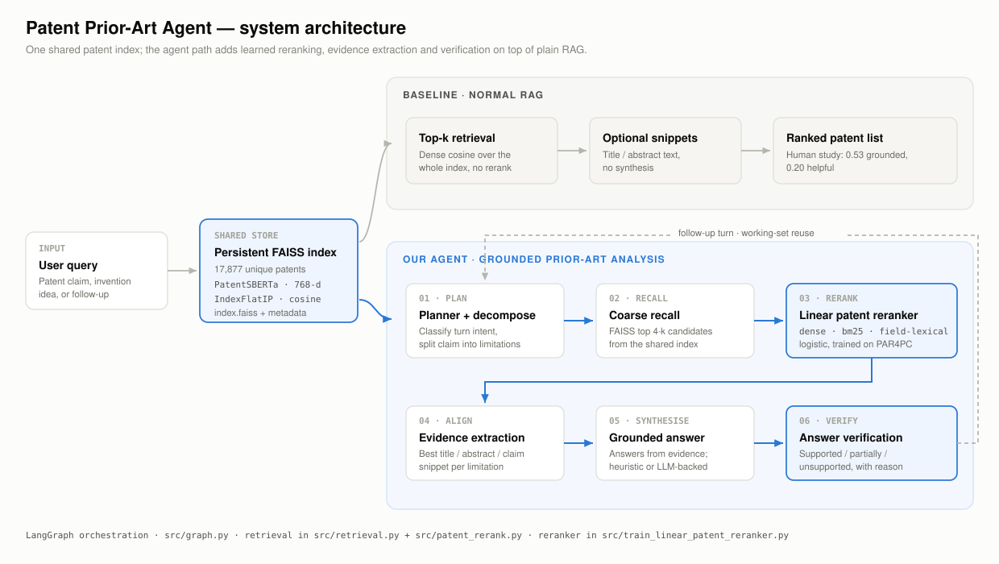

# Architecture

A stage-by-stage walkthrough of how a query becomes a grounded, verified prior-art answer.
For the conceptual version — what each method *means* and which distinctions get confused —
read [`METHODS_OVERVIEW.md`](METHODS_OVERVIEW.md) instead.



---

## 0. The two entry points

The same components serve two modes, and they answer different questions.

| | **Product mode** | **Benchmark mode** |
|---|---|---|
| Question | "Given this idea, what prior art exists and why does it matter?" | "Does our ranking actually beat the baseline on labelled data?" |
| Input | Free text: claim, invention description, vague query, follow-up | One PANORAMA `PAR4PC` case |
| Candidate pool | Persistent FAISS index (open set) | The case's fixed 8 candidates, A–H |
| Output | Ranked patents + evidence + grounded answer + verification | Ranked letters + claim chart + metrics vs gold |
| Entry point | [`web/server.py`](../web/server.py), [`app.py`](../app.py) | [`src/graph.py`](../src/graph.py), [`src/evaluate_par4pc_hf.py`](../src/evaluate_par4pc_hf.py) |

Benchmark mode exists to justify moving a reranker into product mode. Nothing ships to the
product path that has not been measured on PAR4PC first.

---

## 1. The shared store

**Module:** [`src/persistent_index.py`](../src/persistent_index.py)

A persistent local index is *not a model*. It is a patent search backend, materialised as three
files:

```text
data/indexes/<name>/
├── index.faiss        IndexFlatIP over L2-normalised 768-d vectors (cosine via inner product)
├── metadata.parquet   letter, patent_id, title, abstract, claims_json, retrieval_text
└── manifest.json      embedding_model, patent_count, dimension
```

Embeddings come from `AI-Growth-Lab/PatentSBERTa`. `search_persistent_index()` refuses to run
if the requested embedding model does not match the manifest — a mismatched query encoder
against a stored index produces silently wrong neighbours, so it fails loudly instead.

Loading is `lru_cache`'d on the index directory, so the FAISS index, the candidate list and the
manifest are read once per process.

Two indexes are referenced in the codebase:

| Index | Patents | Committed? | Used by |
|---|---:|---|---|
| `par4pc_patentsberta_demo` | 112 | yes | `app.py` default, smoke tests |
| `par4pc_patentsberta_full` | 17,877 | no — build it | `web/server.py` default |

See [`../data/README.md`](../data/README.md) for the build commands.

---

## 2. Stage 01 · Plan and decompose

**Modules:** [`src/query_planner.py`](../src/query_planner.py), [`src/claim_analysis.py`](../src/claim_analysis.py)

Two things happen before any retrieval.

**Turn classification.** `classify_turn()` decides what kind of question this is and what to do
about it:

| Intent | Action | Why |
|---|---|---|
| `compare_previous_results` | `rerank_existing` | "Compare the top two" is about patents already on screen |
| `aspect_filter` | `rerank_existing` | "Which of those also covers X" narrows the current set |
| `follow_up_on_previous_results` | `rerank_existing` | The question refers back to retrieved patents |
| `similar_patent_search` | `retrieve_new` | Needs a fresh search, anchored by the previous top result |
| `combination_exploration` | `retrieve_new` | Combining features needs the wider corpus, not just the current set |
| `new_search` | `retrieve_new` | The default |

Classification is keyword-driven (`FOLLOW_UP_MARKERS`, `COMPARE_MARKERS`, `ASPECT_MARKERS`,
`SIMILAR_MARKERS`, `COMBINATION_MARKERS`) and only fires when a working set already exists —
the first turn of a session is always a new search.

This is the mechanism behind the multi-turn behaviour. When a user asks "which of those also
generates a participant profile?", starting a new search would discard exactly the context that
makes the question answerable. `enrich_query_with_context()` folds the previous query into the
current one when the turn needs it.

**Claim decomposition.** `decompose_claim_heuristic()` drops the preamble before `comprising:`,
then splits the body on semicolons; if that yields a single piece it falls back to splitting on
commas that precede a claim verb (`wherein`, `receiving`, `generating`, `determining`,
`responsive`, `analyzing`, `providing`, `storing`, `transmitting`). With an API key,
`decompose_claim_llm()` does the same job with a model. Long claims are first narrowed by
`_focused_query_text()`, which strips the boilerplate preamble ahead of `comprising:` so that
the retrieval signal is not diluted by patent scaffolding.

---

## 3. Stage 02 · Coarse recall

**Module:** [`src/persistent_index.py`](../src/persistent_index.py)

A single FAISS query returns `max(4·k, 12)` candidates. This is intentionally wide: the point of
the recall stage is to be generous, because the reranker cannot recover a patent that recall
never surfaced.

In benchmark mode this stage is skipped — the case already fixes the 8 candidates.

---

## 4. Stage 03 · Learned reranking

**Modules:** [`src/train_linear_patent_reranker.py`](../src/train_linear_patent_reranker.py),
[`src/patent_rerank.py`](../src/patent_rerank.py)

The shipped reranker is a logistic regression over three features, computed per
(query, candidate) pair:

| Feature | Computed by | What it captures |
|---|---|---|
| `dense_score` | `rank_patent_pool_local_embeddings` | PatentSBERTa cosine similarity, min-max normalised within the candidate set |
| `bm25_score` | `rank_patent_pool_bm25` | Lexical overlap, normalised the same way |
| `field_lexical_score` | `_field_aware_lexical_score` | Weighted term + phrase overlap computed **separately per field** and combined `title 0.15 / abstract 0.30 / claims 0.55` |

The third feature is the patent-specific one. It scores each field independently against the
query, mixes weighted single-term overlap (70%) with multi-word phrase overlap (30%), and
filters through `STRICT_PATENT_STOPWORDS` — a stoplist of patent boilerplate (`comprising`,
`receiving`, `one or more`, `first`, `second`, …) that would otherwise dominate lexical matching
between any two patents.

Shipped configuration:

```json
{ "solver": "liblinear", "c_value": 4.0, "train_splits": ["train"], "max_rows_per_split": 200 }
```

Weights live in [`../data/models/`](../data/models) and load from disk; the model is only
retrained if the file is absent.

`src/patent_rerank.py` also implements richer features — `field_dense_score`,
`field_rarity_score` (IDF-weighted overlap), `coverage_score` (per-limitation evidence support)
and `evidence_score`. They are computed and available, but the three-feature model measured
best on the validation scan, so the extra features are kept for ablation rather than shipped.
See [`src/scan_linear_reranker_configs.py`](../src/scan_linear_reranker_configs.py).

---

## 5. Stage 04 · Evidence extraction

**Module:** [`src/claim_analysis.py`](../src/claim_analysis.py)

For each limitation, `rank_candidate_segments()` scores every segment of a candidate patent —
its title, its abstract, each of its claims — and returns the best match. `build_claim_chart()`
assembles these into a table:

```text
limitation → (candidate patent, source field, evidence snippet, segment score)
```

This is the artefact that separates the system from a ranked list. A user can see *which
sentence* in *which patent* is doing the work for *which part* of their claim.

---

## 6. Stage 05 · Grounded answer

**Modules:** [`src/free_text_qa.py`](../src/free_text_qa.py), [`src/llm_tools.py`](../src/llm_tools.py)

`gather_query_evidence()` collects the top snippets across the reranked candidates, then either:

- `heuristic_rag_answer()` — assembles an answer from the evidence with no model call, or
- `answer_query_with_rag()` — prompts an LLM with the evidence and instructions to cite it.

The default path is heuristic. **The system produces grounded answers without an API key**;
the LLM is an upgrade to fluency, not a dependency for correctness.

---

## 7. Stage 06 · Verification

**Modules:** [`src/claim_analysis.py`](../src/claim_analysis.py), [`src/llm_tools.py`](../src/llm_tools.py)

The last stage re-reads the produced answer against the evidence that was actually retrieved
and labels it:

| Status | Heuristic rule |
|---|---|
| `supported` | Answer/evidence token overlap >= 0.35, **and** the answer carries inline citations, **and** it names at least one of the top-3 retrieved patents |
| `partially_supported` | Overlap >= 0.18 with either citations or a named patent |
| `unsupported` | Anything below that |

Overlap is computed over content tokens only — `PATENT_STOPWORDS` and tokens of three
characters or fewer are dropped, and the answer's own scaffolding lines (`Grounded …`,
`Supporting citations: …`, the not-legal-advice disclaimer) are stripped before scoring, so the
system cannot verify itself against its own boilerplate.

`verify_rag_answer_heuristic()` computes this from content/evidence overlap;
`verify_rag_answer_llm()` asks a model. Either way the status and its reason are surfaced in the
UI rather than kept internal — a "partially supported" badge is information the user needs.

This stage is why the human study shows no fully ungrounded answers: an answer that drifts from
its evidence gets labelled as such instead of being presented as fact.

---

## 8. Orchestration

**Module:** [`src/graph.py`](../src/graph.py)

Benchmark mode runs as an explicit LangGraph state machine:

```text
START → load_case → decompose_claim → retrieve_prior_art
      → extract_evidence → verify_evidence → render_report → END
```

`PatentAgentState` is a `TypedDict` carrying the case, limitations, ranked results, claim chart
and report. Two properties matter:

- **Every node degrades rather than fails.** No API key, no `sentence-transformers`, no trained
  reranker — each falls back to BM25 and appends a line to `state["warnings"]`, which is rendered
  into the report. The system tells you when it substituted a method.
- **`retrieval_method` is a single switch.** Eight methods — `bm25`, `local-embedding`,
  `openai-embedding`, `local-cross-encoder`, `hybrid-coverage`, `patent-specialized`,
  `linear-patent-reranker`, `llm-rerank` — are selectable at one point in the graph, which is what
  makes the benchmark comparisons apples-to-apples.

The product path in [`web/server.py`](../web/server.py) reuses the same components without the
graph, adding a TTL-expiring session store (1 hour) that holds `last_ranked`, `last_snippets`,
`working_patents` and `last_plan` — the state the planner needs for follow-up turns.

---

## 9. Interfaces

| Interface | File | Notes |
|---|---|---|
| Web demo | [`web/server.py`](../web/server.py) + [`web/index.html`](../web/index.html) | FastAPI on `:8899`; single-page UI; `/api/search`, `/api/benchmark/analyze`, `/api/preload` |
| Streamlit app | [`app.py`](../app.py) | Both modes, side-by-side baseline vs optimized comparison |
| CLI | [`src/run_free_text_demo.py`](../src/run_free_text_demo.py), [`src/run_conversation_demo.py`](../src/run_conversation_demo.py) | Scripted demos |

`/api/preload` warms the embedding model and FAISS index so the first real query does not pay
model-load latency.
